<div align="center">

# O R C A

### Oceanic Reasoning & Collaborative Agents

**Evidence-grounded marine decision support with deterministic safety enforcement.**

Smart India Hackathon 2026 · Problem Statement **SIH26176** · Sponsor **ISRO**
Domain: Disaster Management / Marine Intelligence / Fishing Safety


</div>

> ORCA brings marine weather, oceanographic, geospatial and reference advisory
> information into one reasoning workflow — while keeping every safety-critical
> calculation deterministic, traceable and auditable.

ORCA is an **evidence-grounded, safety-constrained marine decision-support
platform**. A large language model interprets a fisherman's, operator's or
researcher's question; deterministic Python code computes every number, every
distance, and every safety verdict; every important claim carries the evidence
that supports it; and the human always makes the final call.

---

## The ORCA Principle

> **AI reasons.**
> **Rules enforce safety.**
> **Evidence supports the decision.**
> **Humans make the final call.**

This is not a tagline — it is an architectural boundary enforced in code and
tested continuously.

The LLM (Groq, the sole provider) touches exactly two points in the pipeline:
turning a natural-language question into a structured query, and phrasing the
final explanation of a decision that has already been computed. It never
touches risk scoring, geofence checks, route legality, distances, polygon
intersections, or the safety status itself — those are pure, deterministic
Python functions with no network access and no randomness. If the LLM is
unavailable, ORCA still runs end-to-end on rule-based fallbacks; the answer's
*wording* may change, the *numbers and safety verdict* never do.

Evidence is never silent. Every observation ORCA uses carries its source, the
tier of trust it was assigned, its timestamp, and its validity window. When two
sources disagree, ORCA does not quietly pick one — it detects the conflict,
resolves it by a documented evidence hierarchy, and shows the disagreement
rather than hiding it.

And when safety cannot be established — because critical data is missing, a
source conflict can't be resolved, or a point sits inside a hard-restricted
zone — ORCA does not guess. It returns an explicit **`NO_SAFE_RECOMMENDATION`**
and leaves the decision to the human, rather than fabricate a confident answer.

---

## Quick navigation

[Why ORCA](#why-orca) ·
[Key capabilities](#key-capabilities) ·
[Product walkthrough](#product-walkthrough) ·
[Architecture](#architecture) ·
[How ORCA reasons](#how-orca-reasons) ·
[Agents vs. deterministic core](#agents-vs-deterministic-core) ·
[Data & evidence model](#data--evidence-model) ·
[Risk & safety model](#risk--safety-model) ·
[PFZ reference intelligence](#pfz-reference-intelligence) ·
[Route intelligence](#route-intelligence) ·
[Fisher Trip Planner](#fisher-trip-planner) ·
[Decision Replay](#decision-replay) ·
[Engine Room & Agent Trace](#engine-room--agent-execution-trace) ·
[Authority Dashboard](#authority-dashboard) ·
[Environmental intelligence](#environmental-intelligence) ·
[Multilingual & accessibility](#multilingual--accessibility) ·
[Data sources](#data-sources) ·
[Tech stack](#tech-stack) ·
[Repository structure](#repository-structure) ·
[Quickstart](#quickstart) ·
[Docker setup](#docker-setup) ·
[Environment variables](#environment-variables) ·
[API overview](#api-overview) ·
[Testing & verification](#testing--verification) ·
[Limitations & honest scope](#limitations--honest-scope) ·
[Security](#security) ·
[Future scope](#future-scope) ·
[Credits](#credits)

---

## Why ORCA

Coastal fishing and marine operations decisions in India today are pieced
together from scattered sources — a weather app, a separate marine forecast, a
printed PFZ advisory bulletin, local knowledge of restricted zones, and
word-of-mouth about conditions. Nothing brings these together, checks them
against each other, or gives a plain-language, source-backed, safety-first
answer to "can I go fishing near Mangalore tomorrow morning?" or "is the route
from here to Kochi clear of restricted waters?"

ORCA is that single reasoning layer. It fuses live marine weather, sea-state,
geofencing, and official reference advisories into one evidence chain, runs a
deterministic risk-and-safety pipeline over it, and hands back an answer with
the reasoning attached — in English, Hindi or Kannada — so a fisherman, a
marine operator, a coastal authority, or a disaster-management desk can decide
with the same evidence, not a black box.

ORCA is **not**:

- a replacement for INCOIS, IMD, or any official warning system,
- an autonomous navigation or emergency-dispatch system,
- a guaranteed fish-catch predictor,
- hardware, an IoT device, or a government-operated service.

It is a decision-**support** tool that keeps the human at the centre of every
safety-relevant call.

---

## Key capabilities

| Capability | What it means |
|---|---|
| **Deterministic decision intelligence** | Risk, safety, and the final decision are computed by pure, testable Python — never by the LLM — including an explicit `NO_SAFE_RECOMMENDATION` outcome when safety cannot be established. |
| **Evidence & provenance** | Every claim traces back through an explicit provenance graph to its source observation; conflicting sources are detected and shown, not hidden. |
| **Marine Map** | Coastline, EEZ, protected/restricted areas, live route, risk overlays, and ranked PFZ reference zones on one Leaflet map. |
| **PFZ reference intelligence** | Nearest official INCOIS Potential Fishing Zone advisories, ranked by distance — never presented as an ORCA-predicted catch signal. |
| **Route intelligence** | A* route planning with hard-geofence avoidance, independent route validation, and an honest comparison against the straight-line baseline (real distance deltas and violation counts — no invented "% safer" claims). |
| **Fisher Trip Planner** | Departure time, available trip time, work duration, and vessel speed turned into a return-by estimate, using the same route the safety chain already validated. |
| **Decision Replay** | Re-runs the real Risk → Safety → Decision chain hour-by-hour across a day, showing exactly when and why a verdict would change. |
| **Engine Room & Agent Trace** | A judge/operator-facing view of how ORCA is built, and a per-query trace of what actually ran — with measured timings, never invented ones. |
| **Authority Dashboard** | A coastal-location overview for authorities: status distribution, locations needing attention, and the same deterministic engine behind every row. |
| **Environmental intelligence** | Descriptive SST and chlorophyll-a context — trophic class, historical comparison, stability, and evidence quality — that never feeds risk, safety, or suitability. |
| **Multilingual** | English, Hindi, and Kannada throughout the UI and the generated explanation. |

---

## Product walkthrough

<!-- SCREENSHOT PLACEHOLDERS — no UI screenshots exist in the repository yet.
     Capture real ones from the running app and save them at the paths below;
     the table will render automatically once the files exist. -->

| Decision Workspace | PFZ Intelligence |
|---|---|
|  |  |

| Engine Room | Authority Dashboard |
|---|---|
|  |  |

| Landing Page | Mobile |
|---|---|
|  |  |

---

## Architecture

```mermaid
flowchart LR
    U[User Query]
    Q[Query Understanding Agent]
    O[LangGraph Orchestrator]

    W[Weather Agent]
    OC[Oceanographic Agent]
    G[GIS & Geofencing Agent]

    DF[Marine Data Fabric]
    TV[Temporal Validity Gate]
    STF[Spatial-Temporal Fusion]
    EA[Evidence Arbitration]
    CD[Conflict Detection]
    SU[Suitability Engine]
    R[Risk Engine]
    SS[Policy & Safety Guard]
    D[Decision Engine]

    RT[Route Agent]
    P[Decision Provenance Graph]
    E[Evidence & Explanation Agent]

    OUT[Decision / Map / Evidence / Alerts]

    U --> Q --> O
    O --> W
    O --> OC
    O --> G

    W --> DF
    OC --> DF
    G --> DF

    DF --> TV --> STF --> EA --> CD
    CD --> SU --> R --> SS --> D
    D --> RT
    D --> P
    RT --> P
    P --> E --> OUT
```

<!-- ARCHITECTURE DIAGRAM PLACEHOLDER -->
<!-- Replace with docs/architecture/orca-architecture.png -->




The diagram shows the safety-critical spine. Environmental intelligence (SST,
chlorophyll-a), PFZ reference lookup, Decision Replay's what-if re-scoring, and
the Authority Dashboard all reuse this same deterministic chain — they run
strictly **after** the decision is computed and never feed back into risk,
safety, or the decision itself. See [How ORCA reasons](#how-orca-reasons)
below for the full node list.

---

## How ORCA reasons

```
User Query
  → Query Understanding          (LLM: Groq, with a deterministic rule-based fallback)
  → Parallel Intelligence Collection
        Weather · Oceanographic · GIS & Geofencing · Environmental · Marine Advisory
  → Marine Data Fabric
  → Temporal Validity Gate
  → Spatial-Temporal Fusion
  → Evidence Arbitration
  → Conflict Detection
  → Fishing Suitability + Risk Engine
  → Policy & Safety Guard
  → Decision Engine
  → Conditional Route Agent            (only when a route was requested and permitted)
  → Alerts
  → Non-blocking intelligence: What-If · PFZ · Environmental Productivity ·
    Environmental Comparison · Stability · Anomaly · Neighbourhood · Evidence · Research
  → Decision Provenance Graph
  → Evidence & Explanation Agent
  → Localised response (English / Hindi / Kannada) → Chat · Map · Evidence · Alerts
```

This is a LangGraph state machine with typed state at every node — no arbitrary
dictionaries are passed between steps. Weather, oceanographic, GIS, environmental
and marine-advisory collection run as five genuinely parallel graph branches.
Every node beyond "What-If" onward in the list above is strictly downstream of
the Decision Engine: risk, safety and decision output are proven
**byte-identical** whether those nodes run, are skipped, or fail.

Two invariants hold everywhere in this pipeline:

1. **The LLM never computes a safety-critical number.** Risk scores, distances,
   polygon intersections, geofence status, and the final decision are pure
   deterministic functions.
2. **A hard geofence and missing critical evidence both outrank everything
   else.** A point inside a hard-restricted zone is `BLOCKED` even if every
   other signal looks fine; missing safety-critical data (not a low score —
   an *absence* of data) forces `NO_SAFE_RECOMMENDATION` rather than a guess.

---

## Agents vs. deterministic core

ORCA's frozen architecture keeps a small set of LLM-capable **agents** for
interpretation and explanation, strictly separate from a much larger
**deterministic reasoning core** that computes and enforces everything else.
The obsolete `planner.py`, `fisheries.py`, `ocean.py` and `geo_safety.py`
agents from an earlier design are retired and are not part of the current
system.

### The seven agents (`backend/app/agents/`)

| Agent | LLM? | Role |
|---|---|---|
| Query Understanding | **Yes** (Groq, JSON-mode, schema-validated, one retry, then a deterministic rule parser) | Language detection, intent classification, and entity / location / date-time / destination extraction. Only *classifies* — it can never change a safety outcome. |
| Weather | No | Wind, temperature, precipitation, pressure and WMO weather code, with live → cache → fallback tiering. |
| Oceanographic | No | Significant wave height, wave direction/period and sea state, same tiered fallback. |
| GIS & Geofencing | No | Coordinate validation, PostGIS layer lookups, restricted-area / hard-and-soft geofence status, spatial evidence. |
| Risk & Suitability coordination | No | Coordinates the deterministic Risk Engine and Fishing Suitability Engine around the pipeline; the engines themselves are separate deterministic modules (below). |
| Route | No | Conditional route planning — destination validation, hard-geofence pre-checks, A* invocation, structured no-route outcomes. |
| Evidence & Explanation | LLM-capable (falls back to a deterministic, i18n template by default) | Turns already-computed results and evidence into a plain-language answer. Every number in the explanation is grounded against the provenance graph; an ungrounded claim triggers a regenerate, then the template — the explanation can never alter the decision. |

Beyond fishing/weather/routing queries, ORCA also runs additional **non-blocking
data-collection branches** in parallel with the core agents — an Environmental
agent (chlorophyll-a via satellite ocean-colour), a Marine Advisory agent (IMD
Sea Area Bulletin classification), and a Historical Environmental agent (for
temporal comparison). None of these ever feed the Risk Engine, the Safety
Guard, or the Decision Engine — they exist purely to enrich evidence and
researcher-facing context, and are described as data sources, not part of the
core reasoning septet.

### Deterministic components (never LLM agents)

| Module | Component |
|---|---|
| `fabric/` | Marine Data Fabric — normalises every agent output into one evidence schema |
| `reasoning/` | Temporal Validity Gate, Spatial-Temporal Fusion, Evidence Arbitration, Conflict Detection |
| `suitability/` | Fishing Suitability Engine |
| `risk/` | Deterministic Risk Engine + `risk_weights.yaml` |
| `policy/` | Policy & Safety Guard |
| `decision/` | Decision Engine (incl. `NO_SAFE_RECOMMENDATION`) |
| `gis/` | Deterministic GIS primitives — point-in-polygon, geodesic distance, geofence checks |
| `routing/` | A* planner + independent hard-geofence route validation |
| `provenance/` | Decision Provenance Graph + numeric grounding |
| `environmental/` | Productivity, Comparison, Stability, Anomaly, Neighbourhood and Evidence engines |
| `alerts/` | Alert Engine |
| `i18n/` | English / Hindi / Kannada localisation |
| `session/` | Multi-turn session state (3–5 turns) |
| `scenario/` | Deterministic demo/regression scenario library |
| `orchestration/` | LangGraph graph definition and typed state |

LangGraph orchestrates the graph; it does not itself reason about safety —
every node it calls is either a narrow LLM agent or a pure deterministic
function.

---

## Data & evidence model

Every observation ORCA uses is tagged with one of five **evidence tiers**, and
sources are never silently blended:

| Tier | Meaning |
|---|---|
| 1 | Authoritative official source |
| 2 | Trusted operational / public source |
| 3 | Verified model / API source |
| 4 | Cached historical data |
| 5 | Illustrative / demo / reference data |

Underneath the tier system, every value also carries a **data-tier flag** —
`LIVE` (fetched now and validated), `CACHE` (a recent live result replayed from
Redis, flagged stale past its TTL), `REFERENCE` (a curated static/official
layer), `DEMO` (explicitly-labelled synthetic data, only when demo fallback is
enabled), or `MISSING` (no usable data at any tier — reported honestly, never
fabricated).

When two sources disagree, ORCA's **Evidence Arbitration** step ranks the
candidates by tier, validity, recency and distance from a fixed hierarchy; a
higher-authority source wins a disagreement, but the conflict is still
recorded. When two equally-authoritative sources disagree, ORCA does **not**
average or silently pick — the disagreement is preserved and surfaced.
**Conflict Detection** then decides whether an unresolved conflict is
safety-critical; if it is, the Safety Guard receives "required evidence
missing" and returns `NO_SAFE_RECOMMENDATION` rather than proceed on
contested data.

Every claim in the final answer is checked against the **Decision Provenance
Graph** — an explicit node/edge structure tracing query → agent results →
observations → validity → fusion → arbitration → conflicts → suitability →
risk → policy → decision → route. A numeric claim in the generated
explanation must match a provenance node or a deterministic scalar, or the
explanation is regenerated and then falls back to a fixed template — the
explanation can describe the decision, but it can never invent one.

---

## Risk & safety model

Risk, safety and the decision are three separate, deterministic stages, each
with its own responsibility:

- **Risk Engine** (`backend/app/risk/`) — a config-driven, weighted scoring
  function over wave height, wind, official advisory signals, a thunderstorm/
  lightning **proxy**, a cyclone **proxy**, and geofence distance. Weights and
  breakpoints live in `risk_weights.yaml`, which is explicit that its
  thresholds are **ORCA engineering / MVP values, not official IMD / ISRO /
  INCOIS marine-safety limits** — they are meant to be reviewed against
  authoritative guidance before any operational use. Missing safety-critical
  data (wave or wind) never becomes a zero score; it marks the result
  `data_sufficiency = INSUFFICIENT` instead.
- **Policy & Safety Guard** (`backend/app/policy/`) — a deterministic rule
  with fixed precedence: a point inside a hard geofence is `BLOCKED`
  regardless of risk score; missing or insufficient safety-critical evidence
  produces `NO_SAFE_RECOMMENDATION`; a `SEVERE` risk score is `BLOCKED`;
  `HIGH`/`MODERATE` is `CAUTION`; otherwise `ALLOWED`. This result is final —
  no later step in the pipeline can override it.
- **Decision Engine** (`backend/app/decision/`) — a fixed mapping from safety
  status to a decision: `ALLOWED → PROCEED`, `CAUTION → PROCEED_WITH_CAUTION`,
  `BLOCKED → DO_NOT_PROCEED`, `NO_SAFE_RECOMMENDATION → NO_SAFE_RECOMMENDATION`.

Hard-geofence protection is defence-in-depth: an occupancy-grid raster blocks
the cell, A* cannot route through it, and an independent post-hoc validator
re-checks the finished route geometry against the original polygons. **No
route may cross a hard geofence** — this is tested as an explicit invariant.

Proxy signals are always labelled as such: thunderstorm/lightning is derived
from WMO weather codes 95–99 and is never called strike-level detection;
cyclone risk is a model-derived signal from pressure and wind, never
presented as certified real-time cyclone tracking.

---

## PFZ reference intelligence

ORCA surfaces the nearest **official INCOIS Potential Fishing Zone (PFZ)
advisory zones**, ranked purely by distance from the queried point, with
restricted-zone status shown alongside. The map and the ranked list stay
selection-synchronised.

This is deliberately **not** presented as an ORCA prediction:

- The ranking is real distance order — never a fabricated suitability or
  catch score.
- Every zone is labelled as an official INCOIS reference, with an explicit
  note that *"PFZ reference is not a safety recommendation."*
- ORCA never claims a predicted fish probability, expected catch, species, or
  revenue figure anywhere in the product.

---

## Route intelligence

The conditional Route Agent only runs when a route was requested and the
Safety Guard has permitted it. It plans an A* route over a geofence-aware
grid, then **re-samples the finished route and re-runs the Safety Guard
against it** — a route can never bypass the safety chain that approved it.

**Route Comparison** puts the ORCA route next to a straight-line baseline and
shows only real, measurable differences:

- distance delta in kilometres (a signed number, not a percentage),
- hard-geofence violation counts for each route,
- feasibility of each route.

There is no fabricated "ORCA is N% safer" metric anywhere in this comparison —
the product deliberately shows the raw numbers and leaves the judgment to the
user.

---

## Fisher Trip Planner

A pure trip-time calculator built on top of the already-validated route and
safety chain — it never runs a second routing or risk computation. Given a
departure time, available trip time, work/fishing duration, and vessel speed,
it derives outbound travel time, return travel time, total trip time, and an
estimated return time against a return-by deadline.

Safety takes precedence unconditionally: a `BLOCKED` or
`NO_SAFE_RECOMMENDATION` decision, or any hard-geofence violation on the
route, makes the trip infeasible regardless of how the time arithmetic works
out.

---

## Decision Replay

Decision Replay re-runs the **same** Risk → Safety → Decision chain used by a
live query, once per hour across a configurable window (up to 24 hours), and
shows:

- an hourly trajectory of risk level and safety status,
- the risk factors and the specific rules that triggered at each hour,
- a "why changed" explanation whenever the decision differs from the previous
  hour, and an explicit "decision stable" indicator when it doesn't.

This is not a separate model — it is the same deterministic engine ORCA uses
for a live assessment, applied at different points in time.

---

## Engine Room & Agent Execution Trace

Two views answer two different questions, and both read from one shared
definition of ORCA's graph so they can never disagree with each other or with
the backend:

- **Engine Room** — a static view of how ORCA is built: data sources → Marine
  Data Fabric → the seven agents (each labelled LLM / deterministic / data) →
  the deterministic reasoning core → output. It's reachable with no query in
  flight, so a judge can open it cold.
- **Agent Execution Trace** — a per-query view of what actually ran this turn:
  graph phases, the parallel data-collection branches (with a truthful
  "N of 5 ran" count), which stages executed vs. were skipped by a conditional
  edge, and **real measured durations** — never fabricated timings. It
  deliberately shows *what* ran and *whether it succeeded*, never the model's
  internal reasoning or a raw prompt.

---

## Authority Dashboard

A coastal-authority-facing overview that fans the **same** deterministic
pipeline used by a single `/query` call across a curated set of coastal
locations — never a second, separate risk computation. It shows:

- a status distribution across locations (safe / caution / high / extreme /
  no-safe-recommendation / blocked),
- a "needs attention" list with category, reason and source,
- a location-intelligence detail view, synchronised between the map and the
  table.

It has explicit **Live** and **Demo** editions: Demo reuses ORCA's own
scenario-fixture pipeline and is clearly labelled in the UI whenever it's
active, so a viewer always knows which edition they're looking at.

---

## Environmental intelligence

ORCA ingests sea-surface temperature (from the same Open-Meteo Marine feed as
wave data) and chlorophyll-a (from satellite ocean-colour data) and turns them
into **descriptive** context — never a fishing or catch signal:

- a chlorophyll-a **trophic class** (oligotrophic → low → moderate → elevated
  → high) and a qualitative productivity-potential label,
- a comparison of the current reading against an ORCA-computed historical
  reference (median over a recent window — explicitly not a climatological
  normal), with a plain higher/lower/unchanged direction,
- a bounded-window **stability** profile (dispersion and coverage, not a
  trend or forecast),
- an **anomaly** view showing where the current reading sits relative to the
  recent distribution,
- a **neighbourhood representativeness** check — whether the single pixel
  ORCA reads is typical of nearby valid pixels,
- an **evidence & reproducibility** block with a categorical data-quality
  status and a copyable reproducibility bundle.

Every one of these outputs carries a disclaimer that chlorophyll-a and SST are
environmental context only. None of them ever reach the Risk Engine, the
Safety Guard, the Decision Engine, suitability, geofencing, routing, or
alerts — this is a tested, provable invariant, not a claim of intent.

---

## Multilingual & accessibility

ORCA's UI and generated answers are available in **English, Hindi, and
Kannada**, driven by a single string table so the app chrome and the backend's
language-detected answer stay consistent.

The chat input also supports **browser-native voice input and read-aloud**,
built entirely on the Web Speech API already present in modern browsers — a
recognised utterance fills the chat draft (the user still presses Send; voice
never bypasses Query Understanding or the deterministic pipeline), and answers
can optionally be read back with `speechSynthesis`. There is no server-side
speech infrastructure — this is a browser capability, not a hosted service.

---

## Data sources

| Source | Tier | Role |
|---|---|---|
| **Open-Meteo Weather API** | LIVE, primary | Wind, precipitation, pressure, WMO weather code |
| **Open-Meteo Marine API** | LIVE, primary | Wave height/direction/period, swell, sea-surface temperature |
| **NOAA CoastWatch ERDDAP** (VIIRS chlorophyll-a) | LIVE, environmental / non-blocking | Satellite chlorophyll-a — never feeds risk/safety/decision |
| **INCOIS ERDDAP** (chlorophyll-a) | LIVE, optional secondary | Only used when explicitly configured; never a required dependency |
| **INCOIS PFZ advisory** | REFERENCE | Official Potential Fishing Zone advisory snapshots — not an ORCA prediction |
| **IMD Sea Area Bulletin** | LIVE, official (key-gated) | Marine advisory classification; degrades to an honest "unavailable" without credentials |
| **RSMC / IMD tropical weather outlook** | REFERENCE | Official bulletin snapshot; ORCA's cyclone signal remains a model-derived proxy, not a live feed of this source |
| **Natural Earth coastline** | REFERENCE | Cartographic coastline baseline — not an authoritative maritime boundary |
| **Marine Regions World EEZ v12** | REFERENCE | Exclusive Economic Zone polygon layer |
| **WDPA (Protected Planet)** | REFERENCE | Protected-area layer (a small demo subset is git-tracked; full ingest is scripted but not run) |
| **GEBCO bathymetry** | REFERENCE | Water-depth / on-land proxy — not authoritative navigation data |
| **MOSDAC (ISRO)** | Structure only | Wired for future use; no verified machine-readable endpoint yet, strictly non-blocking |
| **Copernicus Marine** | Not yet integrated | Deferred — the current Data Store requires a new SDK dependency and a registered account |

Every data agent follows the same **3-tier fallback**: live API → Redis cache
→ local/reference/demo data, with source and freshness tracked on every value.
Open-Meteo is never presented as INCOIS or IMD; a reference PFZ zone is never
presented as an ORCA prediction; a model-derived proxy is never presented as a
certified detection.

---

## Tech stack

| Layer | Choice |
|---|---|
| Backend | Python 3.11 · FastAPI · Pydantic · httpx · async SQLAlchemy + psycopg |
| Orchestration | LangGraph (+ langchain-core) |
| LLM | Groq — the sole provider (`openai/gpt-oss-120b` by default, configurable) |
| Deterministic core | NumPy · Shapely · pyproj — offline geometry / grid math, no network |
| Datastores | PostgreSQL + PostGIS · Redis |
| Frontend | React 18 · TypeScript · Vite · Leaflet / react-leaflet + OpenStreetMap tiles |
| Frontend testing | Vitest + Testing Library |
| Containerisation | Docker Compose |

No second LLM provider, no vector database, no extra microservices, no second
database — the architecture is intentionally frozen at this shape.

---

## Repository structure

```
orca/
├── backend/
│   ├── app/
│   │   ├── agents/            # the 7 agents + non-blocking data collectors
│   │   ├── orchestration/     # LangGraph graph definition + typed state
│   │   ├── fabric/            # Marine Data Fabric
│   │   ├── reasoning/         # temporal validity, fusion, arbitration, conflicts
│   │   ├── risk/  policy/  decision/   # deterministic safety chain
│   │   ├── routing/           # A* + hard-geofence validation
│   │   ├── environmental/     # SST / chlorophyll-a intelligence engines
│   │   ├── provenance/        # provenance graph + numeric grounding
│   │   ├── gis/  fabric/  alerts/  i18n/  session/  scenario/
│   │   └── api/                # FastAPI routers
│   ├── tests/                  # backend test suite
│   ├── Dockerfile
│   └── requirements.txt
├── frontend/
│   ├── src/
│   │   ├── components/         # decision, evidence, route, replay, trip, system, ...
│   │   ├── dashboard/          # Authority Dashboard
│   │   ├── maps/                # MarineMap, AuthorityMap
│   │   ├── i18n/                 # en / hi / kn string tables
│   │   ├── domain/               # pure calculation logic (trip planner, route compare)
│   │   ├── hooks/  services/  pages/
│   │   └── test/                 # Vitest component tests
│   └── Dockerfile
├── data/
│   ├── static/                  # git-tracked coastline / EEZ / WDPA / bathymetry layers
│   └── reference/                # official PFZ / RSMC reference snapshots
├── docs/                          # architecture, data-source and phase docs
├── docker/postgis/init.sql
├── scripts/                       # static GIS ingestion
└── docker-compose.yml
```

---

## Quickstart

```bash
git clone https://github.com/Kushall-07/ORCA.git
cd ORCA
cp .env.example .env        # fill in GROQ_API_KEY to enable LLM phrasing (optional)
docker compose up --build
```

- Frontend: <http://localhost:3000>
- Backend API docs: <http://localhost:8000/docs>
- PostgreSQL/PostGIS: `localhost:5432` · Redis: `localhost:6379`

ORCA runs with **no `.env` at all** for a first look — every variable has a
working default in `docker-compose.yml`, and the pipeline runs deterministically
without `GROQ_API_KEY` (rule-based query understanding, template explanations).

### Running each part on the host, without Docker

```bash
# Backend
cd backend
python -m venv .venv
.venv\Scripts\activate            # PowerShell; use source .venv/bin/activate on Linux/macOS
pip install -r requirements-dev.txt
python run.py                     # or: uvicorn app.main:app --reload --port 8000

# Frontend
cd frontend
npm install
npm run dev                       # http://localhost:3000
```

`GET /health` works with no datastores running; `GET /health/ready` reports
`degraded` with a per-dependency breakdown until PostgreSQL/PostGIS and Redis
are reachable.

---

## Docker setup

`docker-compose.yml` defines four services:

| Service | Image / build | Port | Notes |
|---|---|---|---|
| `postgres` | `postgis/postgis:16-3.4` | `5432` | Healthcheck-gated; `backend` waits for it to be healthy |
| `redis` | `redis:7-alpine` | `6379` | Healthchecked; a Redis outage degrades every cache op to a miss, never a crash |
| `backend` | built from `./backend` (`python:3.11-slim`) | `8000` | Mounts `./data` read-only; waits on both datastores |
| `frontend` | built from `./frontend` (`node:22-alpine`, dev stage) | `3000` | Vite dev server with hot reload; a `prod` stage (served by nginx) is also defined for deployment builds |

---

## Environment variables

Copy `.env.example` to `.env`; **never commit `.env`.** Every variable has a
safe default so the stack runs out of the box.

| Variable | Needed for | Notes |
|---|---|---|
| `GROQ_API_KEY` / `GROQ_MODEL` | LLM phrasing | Groq is the only LLM provider; unset → deterministic fallbacks everywhere |
| `DATABASE_URL` | always | PostgreSQL/PostGIS connection string |
| `REDIS_URL` | always | Redis connection string |
| `POSTGRES_USER` / `POSTGRES_PASSWORD` / `POSTGRES_DB` | always | Local container credentials (non-secret defaults) |
| `CORS_ORIGINS` / `LOG_LEVEL` / `ENVIRONMENT` | operational | |
| `OPENMETEO_*` | weather/marine | Endpoint URLs, timeouts, retries |
| `OCEANCOLOR_*` | environmental | NOAA/INCOIS chlorophyll-a ERDDAP configuration |
| `MOSDAC_USERNAME` / `MOSDAC_PASSWORD` | future | Non-blocking; read if set |
| `COPERNICUS_USERNAME` / `COPERNICUS_PASSWORD` | future | Not yet integrated; placeholder only |
| `WDPA_API_TOKEN` | future | Protected-area layer ingest |
| `AGENT_DEMO_FALLBACK` | demo | Explicitly enables the DEMO data tier |
| `VITE_API_URL` | frontend | Backend base URL as seen from the browser |

See `.env.example` for the full, current list.

---

## API overview

| Endpoint | Purpose |
|---|---|
| `GET /` · `GET /health` · `GET /health/ready` | Service banner, liveness, and per-dependency readiness |
| `POST /query` | The main conversational assessment — runs the full LangGraph pipeline and returns decision, risk, suitability, route, evidence, conflicts, provenance, and agent/node trace |
| `GET /gis/layers` · `GET /gis/layers/{id}` | Static map layers (coastline, EEZ, protected areas), each carrying provenance metadata |
| `GET /reference/registry` · `GET /reference/pfz` · `GET /reference/rsmc` | Official reference snapshots (PFZ advisory image, RSMC/IMD bulletin) |
| `POST /whatif` | Deterministic what-if re-scoring of a hypothetical change |
| `POST /replay` | Decision Replay — hourly re-scoring across a time window |
| `POST /route/baseline` | Straight-line baseline for Route Comparison |
| `GET /authority/overview` | Authority Dashboard aggregation across coastal locations |

Full request/response contracts are in the FastAPI OpenAPI docs at `/docs` once
the backend is running.

---

## Testing & verification

```bash
cd backend && pytest          # 1,502 backend tests — all passing
cd frontend && npm test       # 284 frontend tests across 22 files — all passing
```

Both suites are fully mocked — no live network calls, no dependency on a real
Groq key, deterministic and repeatable. Backend coverage spans unit tests for
every deterministic engine (risk, safety, decision, routing, fusion,
arbitration, environmental engines), agent-level tests, orchestration/graph
integration tests, API contract tests, and dedicated **safety-isolation
invariant tests** that assert Route, Trip Planner, Decision Replay, What-If,
PFZ, and environmental intelligence output is byte-identical whether those
features run, are skipped, or fail — none of them may influence risk, safety
or the decision.

A deterministic **Scenario Engine** runs judge-ready demo scenarios through
the real pipeline with offline fixtures — no live network required:

```bash
cd backend
python -m app.scenario.run --list                                   # 26 scenarios
python -m app.scenario.run --all                                    # PASS/FAIL summary
python -m app.scenario.run --scenario 04_maritime_route
python -m app.scenario.run --perf 01_fisherman_safe --repeat 30     # min/median/p95/max
```

Scenarios assert *structure* (intent, decision family, evidence presence,
conflict preservation, provenance completeness) against the real pipeline —
never a brittle fixed live value.

---

## Limitations & honest scope

- ORCA assesses **one queried point at a time**, not a multi-region spatial
  risk aggregation — the Authority Dashboard fans the same single-point
  pipeline across a curated location list rather than computing a true
  regional risk field.
- Risk thresholds in `risk_weights.yaml` are ORCA engineering/MVP values, not
  official IMD/ISRO/INCOIS safety limits, and are labelled as such everywhere
  they surface.
- The thunderstorm/lightning and cyclone signals are model-derived **proxies**
  from weather codes and pressure/wind data — not certified detection systems.
- PFZ advisories are official INCOIS reference snapshots, surfaced by
  distance — ORCA does not predict fish presence, species, catch, or revenue.
- Chlorophyll-a and SST intelligence is descriptive environmental context and
  never a fishing-productivity guarantee.
- MOSDAC and Copernicus Marine integrations are placeholders in the current
  release — no verified machine-readable MOSDAC endpoint is wired in, and
  Copernicus Marine's current Data Store requires a dependency and account
  registration that are deferred past this release.
- IMD Sea Area Bulletin access requires credentials that are not obtainable
  through self-service today; without them, the advisory surfaces an honest
  "unavailable" rather than a fabricated bulletin.
- A live, running Docker Compose stack was validated by structural inspection
  of the compose file and Dockerfiles for this release; treat `docker compose
  up --build` as the primary supported path and verify it in your own
  environment before a live demo.
- There is no CI pipeline in this repository yet — tests are run locally
  (`pytest`, `npm test`) as shown above.

---

## Security

- No secret is ever logged; connection strings are never exposed by the health
  endpoints.
- `.env` is git-ignored; only `.env.example` (names, no values) is tracked.
- The Query Understanding system prompt explicitly states that user text can
  never change safety policy, thresholds, geofences, tool results, or force an
  `ALLOWED` outcome — covered by a dedicated prompt-injection scenario in the
  Scenario Engine.
- Backend error responses never leak a stack trace to the client.
- There is currently no authentication layer in front of the API — this is an
  MVP/hackathon build intended for a controlled demo environment, not a
  public-internet deployment.

If you discover a security issue, please open a private report to the
repository owner rather than a public issue.

---

## Future scope

- Regional, multi-point spatial risk aggregation (beyond today's single-point
  assessment).
- Multi-year environmental climatology and trend/time-series analysis, beyond
  today's descriptive stability and anomaly views.
- Full India-wide WDPA protected-area ingest (currently a small demo subset).
- Live MOSDAC and Copernicus Marine integration once endpoint access and
  SDK/account requirements are resolved.
- Self-service IMD Sea Area Bulletin credentials for uninterrupted advisory
  coverage.
- A CI pipeline running the backend and frontend suites on every change.

---

## Credits

Built for **Smart India Hackathon 2026**, problem statement **SIH26176**,
sponsored by **ISRO**, under the Disaster Management theme.

**License:** this repository does not currently include a license file. All
rights are reserved by the author unless a license is added.

<div align="center">

*ORCA is a decision-support tool for the human decision-maker — not a
replacement for official warnings, autonomous navigation, or guaranteed catch
prediction.*

</div>
